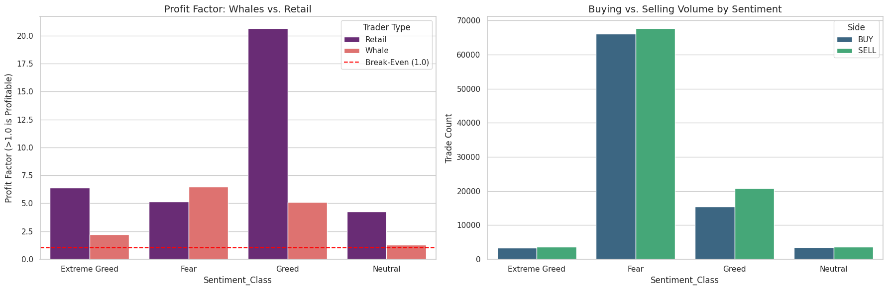

# Analysis: Trader Performance vs. Market Sentiment

## Executive Summary
This project analyzes the behavior of traders on Hyperliquid against the backdrop of Bitcoin Market Sentiment (Fear & Greed Index). By segmenting users into "Whales" (Top 10% volume) and "Retail", I uncovered a distinct divergence in risk efficiency.

## Key Findings

### 1. The "Smart Money" Alpha in Fear
While trading volume spikes during market panic ("Fear" sentiment), **Whales** demonstrated superior capital efficiency during these volatility events.
- **Whale Profit Factor (Fear):** 6.49
- **Retail Profit Factor (Fear):** 5.15
- **Insight:** Whales are significantly more effective at navigating downside volatility, likely utilizing liquidity to enter favorable positions while retail panic-sells.

### 2. Retail Momentum Dominance
Contrary to the assumption that retail always loses, Retail traders showed exceptional performance during "Greed" phases.
- **Retail Profit Factor (Greed):** 20.67
- **Whale Profit Factor (Greed):** 5.08
- **Insight:** Retail traders appear to be highly effective "Trend Followers," capitalizing on momentum during established bullish sentiment.

### 3. Whale Apathy in Neutral Markets
Whale performance drops significantly in "Neutral" conditions (Profit Factor **1.29**), suggesting that large-scale players require directional volatility to deploy capital effectively, whereas retail traders continue to find opportunities in sideways markets.

## Methodology
- **Data Engineering:** 200k+ trades were merged with daily sentiment data.
- **Cohort Segmentation:**
  - **Whales:** Trade Size > $8,279.50 (Top 90th Percentile).
  - **Retail:** Trade Size < $8,279.50.
- **Metric:** *Profit Factor* (Gross Profit / Gross Loss) was used as the primary efficiency metric to normalize for volume differences.

## Visualizations

## Tech Stack
- **Python:** Data processing.
- **Pandas/Seaborn:** Analytics and Visualization.
